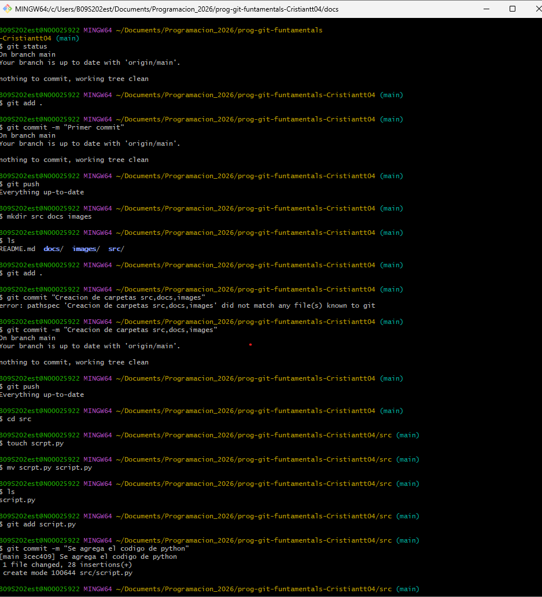
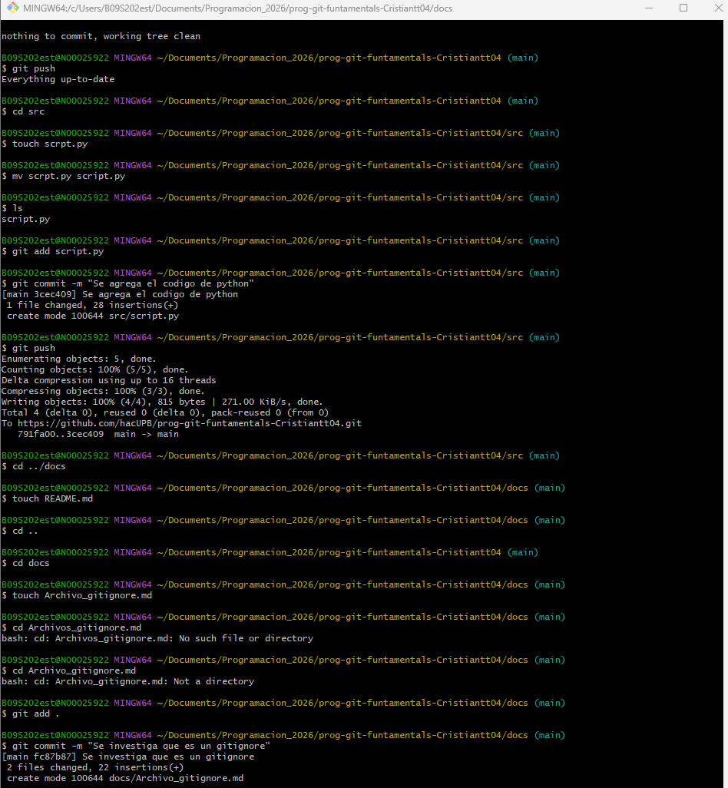

## 💻 **Uso de la Consola en Proyectos de Programación** 

🧠 **¿Qué es la consola o terminal?**

La consola (también llamada terminal o línea de comandos) es una herramienta que permite interactuar con el sistema operativo mediante comandos de texto.
En programación se usa para:

Navegar entre carpetas del proyecto
Crear y organizar archivos y directorios
Ejecutar programas y scripts
Usar herramientas como Git, Node, Python, etc.

Trabajar con la consola hace el desarrollo más rápido, preciso y profesional.

##

📂 **Navegación entre directorios**

Uno de los conceptos más importantes es saber dónde estás ubicado dentro del sistema de archivos y cómo moverte entre carpetas.
Conceptos clave

Directorio actual: carpeta en la que estás trabajando
Ruta absoluta: ruta completa desde la raíz del sistema
Ruta relativa: ruta basada en tu ubicación actual

##
🗂️ **Creación y gestión de directorios**

Los directorios (carpetas) sirven para organizar el proyecto: código fuente, recursos, configuraciones, etc.
Con la consola puedes:

Crear carpetas

Entrar en ellas

Ver su contenido

Eliminar carpetas innecesarias

Esto es fundamental para mantener una estructura limpia del proyecto.
##
**Lista de comandos** 

**pwd**        # Muestra la ruta del directorio actual

**ls**        # Lista archivos y carpetas

**ls -a**     # Lista incluyendo archivos ocultos

**cd nombre**  # Entra a un directorio

**cd ..**     # Sube un nivel

**cd /**      # Va a la raíz del sistema

**mkdir carpeta        # Crea un directorio**

**mkdir -p a/b/c**       # Crea directorios anidados

**rmdir carpeta**        # Elimina un directorio vacío

**rm -r carpeta**        Elimina un directorio con contenido

**touch archivo.txt**    # Crea un archivo vacío

**cat archivo.txt****      # Muestra el contenido del archivo

**rm archivo.txt**       # Elimina un archivo

